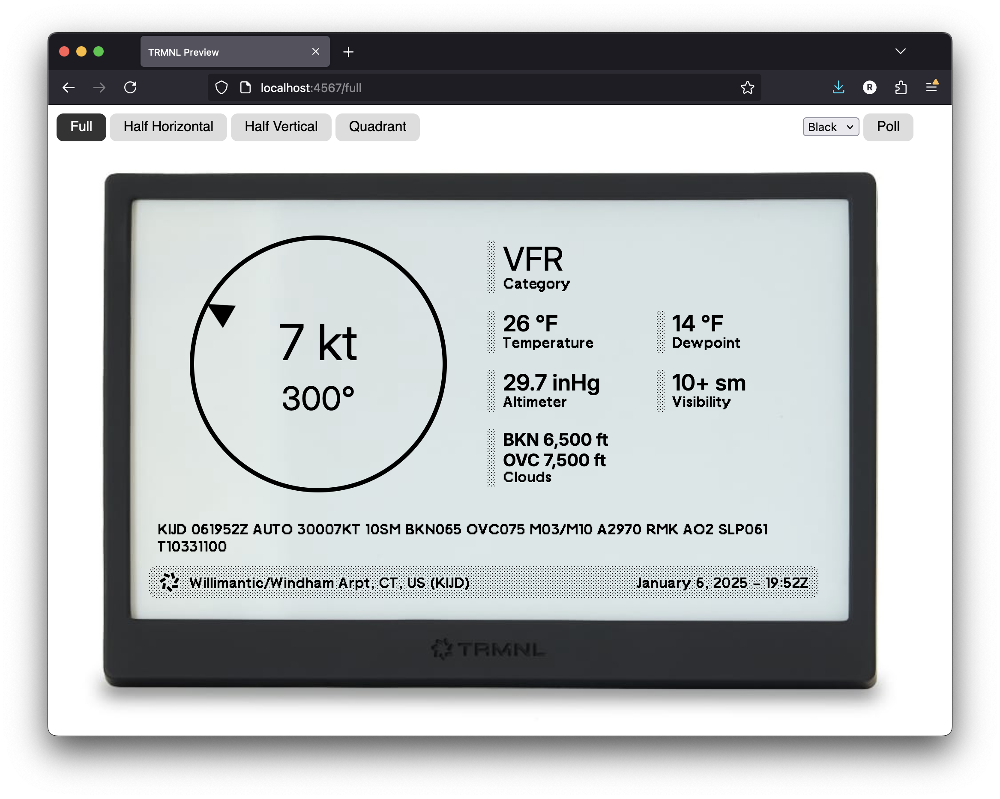

# trmnlp

[](https://github.com/usetrmnl/trmnlp/actions/workflows/ci.yaml)
[](https://rubygems.org/gems/trmnl_preview)

A basic self-hosted web server to ease the development and sharing of [TRMNL](https://trmnl.com/) plugins.

[Liquid](https://shopify.github.io/liquid/) templates are rendered leveraging the [TRMNL Design System](https://trmnl.com/framework). They may be generated as HTML (faster, and a good approximation of the final result) or as PNG images (slower, but more accurate).

The server watches the filesystem for changes to the Liquid templates, seamlessly updating the preview without the need to refresh.



## Quick Start

```sh
gem install trmnl_preview     # install
trmnlp init my_plugin         # scaffold a project
cd my_plugin
trmnlp serve                  # preview at http://localhost:4567
```

No Ruby on hand? Run it through Docker instead — see [Installing via Docker](#installing-via-docker).

## Project Structure

This is the structure of a plugin project:

```
.
├── .trmnlp.yml
├── bin
│   └── trmnlp
└── src
    ├── full.liquid
    ├── half_horizontal.liquid
    ├── half_vertical.liquid
    ├── quadrant.liquid
    ├── shared.liquid
    └── settings.yml
```

| File | Purpose |
|---|---|
| `.trmnlp.yml` | Local dev-server config — not uploaded to TRMNL |
| `src/full.liquid` | Markup for the full screen |
| `src/half_horizontal.liquid` | Top or bottom half of a stacked mashup |
| `src/half_vertical.liquid` | Left or right half of a side-by-side mashup |
| `src/quadrant.liquid` | One quarter of a 2x2 mashup |
| `src/shared.liquid` | Reusable markup included by the other templates |
| `src/settings.yml` | Plugin configuration — uploaded to TRMNL |

## Creating a New Plugin

You can start building a plugin locally, then `push` it to the TRMNL server for display on your device.

```sh
trmnlp init [my_plugin]  # generate
cd [my_plugin]
trmnlp serve             # develop locally
trmnlp login             # authenticate
trmnlp push              # upload
```

## Modifying an Existing Plugin

If you have built a plugin with the web-based editor, you can `clone` it, work on it locally, and `push` changes back to the server.

```sh
trmnlp login                   # authenticate
trmnlp clone [my_plugin] [id]  # first download
cd [my_plugin]
trmnlp serve                   # develop locally
trmnlp push                    # upload
```

## Commands

| Command | Description |
|---|---|
| `trmnlp init NAME` | Start a new plugin project |
| `trmnlp serve` | Start a local dev server |
| `trmnlp build` | Generate static HTML files, or PNGs with `--png` |
| `trmnlp lint` | Check plugin code against TRMNL best practices |
| `trmnlp login` | Authenticate with TRMNL server |
| `trmnlp list` | List private plugins from TRMNL server |
| `trmnlp clone NAME ID` | Copy a plugin project from TRMNL server |
| `trmnlp pull` | Download latest plugin settings from TRMNL server |
| `trmnlp push` | Upload latest plugin settings to TRMNL server |
| `trmnlp version` | Show version |

`trmnlp lint` exits non-zero when it finds issues, so you can gate CI on it. Run `trmnlp help` for all flags.

## Building Static Files

`trmnlp build` renders every view to a static file under `_build/` — handy for exporting a snapshot or feeding the output into another pipeline. Run it from inside a plugin project:

```sh
trmnlp build        # writes _build/full.html, _build/half_horizontal.html, ...
trmnlp build --png  # also writes a PNG for each view
```

`--png` renders each view through the same screenshot pipeline `serve` uses. By default a PNG is 800×480 at the bit depth declared by the markup's `screen--Nbit` class (1-bit if none). Override any of those:

```sh
trmnlp build --png --color-depth 2
```

| Flag | Purpose |
|---|---|
| `--png` | Render a PNG per view alongside the HTML |
| `--width` | PNG width in pixels (default 800) |
| `--height` | PNG height in pixels (default 480) |
| `--color-depth` | PNG bit depth — 1, 2, or 4 — overriding the markup |

`--width`, `--height`, and `--color-depth` apply only with `--png`. PNG rendering needs Firefox and ImageMagick installed; plain `trmnlp build` needs neither.

## Authentication

The `trmnlp login` command saves your API key to `~/.config/trmnlp/config.yml`.

If an environment variable is more convenient (for example in a CI/CD pipeline), you can set `$TRMNL_API_KEY` instead.

## Continuous Integration

`trmnlp` runs in GitHub Actions without `trmnlp login` — set the `TRMNL_API_KEY`
environment variable and it's used in place of the saved config. Add it as a
repository secret, then drop this into `.github/workflows/trmnl.yml`:

```yaml
name: TRMNL
on:
  pull_request:
  push:
    branches: [main]

jobs:
  lint:
    runs-on: ubuntu-latest
    steps:
      - uses: actions/checkout@v6
      - uses: ruby/setup-ruby@v1
        with:
          ruby-version: "4.0"
      - run: gem install trmnl_preview
      - run: trmnlp lint

  push:
    needs: lint
    if: github.ref == 'refs/heads/main'
    runs-on: ubuntu-latest
    steps:
      - uses: actions/checkout@v6
      - uses: ruby/setup-ruby@v1
        with:
          ruby-version: "4.0"
      - run: gem install trmnl_preview
      - run: trmnlp push --force
        env:
          TRMNL_API_KEY: ${{ secrets.TRMNL_API_KEY }}
```

The `lint` job gates every pull request — `trmnlp lint` exits non-zero on
issues, so a failing check blocks the merge. The `push` job uploads to TRMNL
only on `main`.

> **Make sure `src/settings.yml` has an `id`.** `trmnlp push` updates the
> plugin with that id; without one it creates a *new* plugin on every run.
> Projects made with `trmnlp clone` or `trmnlp pull` already have it.

## Running trmnlp

The `bin/trmnlp` script is provided as a convenience. It will use the local Ruby gem if available, falling back to the `trmnl/trmnlp` Docker image.

You can modify the `bin/trmnlp` script to set up environment variables (plugin secrets, etc.) before running the server.

**Gem or Docker?** Install the gem if you already have Ruby >= 3.4 — it has the fastest startup. Use Docker for zero local setup.

### Installing via RubyGems

Prerequisites:

- Ruby >= 3.4
- For PNG rendering (optional):
  - Firefox
  - ImageMagick

```sh
gem install trmnl_preview
trmnlp serve
```

### Installing via Docker

```sh
docker run \
    --publish 4567:4567 \
    --volume "$(pwd):/plugin" \
    trmnl/trmnlp serve
```

Inside a container, `serve` binds to `0.0.0.0` automatically (it detects `/.dockerenv`) so the preview is reachable from your host browser. Outside Docker it binds to `127.0.0.1`.

Swap `serve` for any other command (`lint`, `login`, `clone`, etc.) to run it in a one-off container.

#### Interactive Mode

For running multiple commands (login, clone, serve), you can start an interactive shell:

```sh
docker run -it \
    --publish 4567:4567 \
    --volume "$HOME/.config/trmnlp:/root/.config/trmnlp" \
    --volume "$(pwd):/plugin" \
    --entrypoint /bin/bash \
    trmnl/trmnlp
```

Then run commands inside the container:

```sh
trmnlp login
trmnlp clone my_plugin 12345
cd my_plugin
trmnlp serve
```

The config volume (`$HOME/.config/trmnlp`) persists your API key between sessions.

#### Docker Compose

For a checked-in config — like [`examples/hn-stories/`](examples/hn-stories/) uses — a minimal `docker-compose.yml`:

```yaml
services:
  trmnlp:
    image: trmnl/trmnlp
    command: ["serve"]
    ports:
      - "4567:4567"
    volumes:
      - .:/plugin
```

Then `docker compose up`.

#### Building Locally

To build the Docker image from source:

```sh
git clone https://github.com/usetrmnl/trmnlp.git
cd trmnlp
docker build -t trmnlp .
```

## `.trmnlp.yml` Reference - Project Config

The `.trmnlp.yml` file lives in the root of the plugin project, and is for configuring the local dev server.

System environment variables are made available in the `{{ env }}` Liquid varible in this file only. This can be used to safely
supply plugin secrets, like API keys.

All fields are optional.

```yaml
---
# auto-reload when files change (`watch: false` to disable)
watch:
  - src
  - .trmnlp.yml

# values of custom fields (defined in src/settings.yml)
custom_fields:
  station: "{{ env.ICAO }}" # interpolate $IACO environment variable

# Time zone IANA identifier to inject into trmnl.user; see https://en.wikipedia.org/wiki/List_of_tz_database_time_zones
time_zone: America/New_York

# Serverless transforms run automatically when a src/transform.*
# file is present. Set to 'disabled' to turn off.
transform_runtime: enabled

# Optional remote transform daemon URL — when set, transforms POST
# here instead of running locally. Useful for production-fidelity
# testing against a real microVM daemon.
# serverless_daemon_url: https://transforms.your-team.example

# Optional explicit language for src/transform.* (otherwise inferred from extension)
# serverless_language: python

# override variables
variables:
  trmnl:
    user:
      name: Peter Quill
    plugin_settings:
      instance_name: Kevin Bacon Facts

```

## Serverless Transforms

`trmnlp` can run a transform script (`python`, `ruby`, `php`, or `node`) against the polled API response before handing data to your Liquid templates — matching the hosted plugin service's behavior.

Drop a file at `src/transform.{py,rb,php,js}` and define a `run(input)` function — transforms are enabled by default, so it runs automatically. To turn them off, set `transform_runtime: disabled` in `.trmnlp.yml`.

> **Heads up:** because transforms run by default, a plugin you `clone` or `pull` from somewhere else will execute its `src/transform.*` code on your machine the first time you preview it — there is no opt-in prompt. Review a third-party plugin's transform script before serving it, or set `transform_runtime: disabled`.

The transform receives the polled response on stdin as JSON; whatever `run(input)` returns becomes the new merge data.

Example `src/transform.py`:

```python
def run(input):
    return {"items": [x["title"] for x in input["data"]]}
```

The trmnlp image bundles `python3`, `node`, `php`, and `ruby` — no sidecar daemon required.

### Language detection

The transform language comes from the **file extension**:

| File              | Language |
|-------------------|----------|
| `src/transform.py`  | `python` |
| `src/transform.rb`  | `ruby`   |
| `src/transform.js`  | `node`   |
| `src/transform.php` | `php`    |

`trmnlp push` uploads the file under its own name, and the hosted service records `serverless_language` from the extension automatically — you don't need to set it by hand. `trmnlp pull` / `trmnlp clone` bring the transform file back under the same name.

### Pointing at a remote daemon

For production-fidelity testing against a real microVM daemon, set `serverless_daemon_url:` in `.trmnlp.yml`:

```yaml
transform_runtime: enabled
serverless_daemon_url: https://transforms.your-team.example
```

Provide the daemon's bearer token via `$TRMNL_SERVERLESS_DAEMON_API_KEY` (env-first, mirroring how `$TRMNL_API_KEY` works for trmnl.com auth):

```sh
export TRMNL_SERVERLESS_DAEMON_API_KEY=...
trmnlp serve
```

Or commit a per-project value to `.trmnlp.yml` as `serverless_daemon_api_key:` — though the env var is preferred to keep the secret out of version control.

A complete worked example lives at [`examples/hn-stories/`](examples/hn-stories/) — a polling plugin that fetches the Hacker News top-stories list, enriches each story via additional HTTPS calls from inside the transform, and renders the result with TRMNL design-system markup across all four sizes. `cd examples/hn-stories && docker compose up` and you're running it.

## `src/settings.yml` Reference (Plugin Config)

The `settings.yml` file is part of the plugin definition, and is uploaded and downloaded by `trmnlp push` / `pull`.

`framework_version:` pins the [TRMNL Design System](https://trmnl.com/framework) version this plugin renders against — `latest` (the default) tracks the newest release, or set a specific version for reproducibility. It lives here rather than in `.trmnlp.yml` so the value round-trips with the hosted plugin service.

See [TRMNL documentation](https://help.trmnl.com/en/articles/10542599-importing-and-exporting-private-plugins#h_581fb988f0) for details on this file's contents.


## Development

To run trmnlp from a checkout of this repo — handy for trying unreleased changes or contributing:

```sh
git clone https://github.com/usetrmnl/trmnlp.git
cd trmnlp
bundle install
bundle exec bin/trmnlp serve
```

The repo pins its Ruby version in `.ruby-version` — a version manager will pick it up when you `cd` in. This `bin/trmnlp` runs the CLI straight from `lib/`; it's a different script from the gem-or-Docker `bin/trmnlp` that `trmnlp init` scaffolds into a plugin project.

## Tests

To test, run:

```sh
bin/rake
```

Specs run under SimpleCov; a coverage report is written to `coverage/`.

## Releasing

Releases are automated. The [`Release` workflow](.github/workflows/release.yaml)
fires whenever `lib/trmnlp/version.rb` changes on `main`, then tags the commit,
publishes the gem to RubyGems, and pushes the multi-arch Docker image. Each step
is idempotent, so the workflow is safe to re-run after a partial failure.

To cut a release:

1. Bump the version in `lib/trmnlp/version.rb`.
2. Run `bundle install` so `Gemfile.lock` picks up the new version.
3. Commit and merge to `main` — the workflow does the rest.

By convention, add a matching `CHANGELOG.md` entry in the same change.

## Contributing

Bug reports and pull requests are welcome on GitHub at https://github.com/usetrmnl/trmnlp.

## License

The gem is available as open source under the terms of the [MIT License](https://opensource.org/licenses/MIT).
