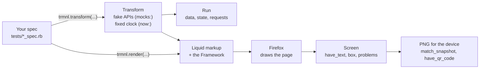

# Testing Plugins

`trmnlp test` runs the RSpec files in your plugin's `tests/` folder.

- It uses the same pipeline that `serve` and `build` use.
- It answers API requests with fake responses.
- It starts every clock at a fixed time.



## Quick start

`trmnlp init` creates a plugin that is ready to test.

- It adds `tests/plugin_spec.rb`, which holds `it_behaves_like 'a publishable recipe'`.
- It adds a GitHub workflow that runs the tests in the `trmnl/trmnlp` image.
- The workflow uploads the report.
- A manual run of the workflow can rewrite the snapshots.
- The workflow pushes to TRMNL only after lint and tests pass.

Here is a spec you can write yourself:

```ruby
# tests/weather_spec.rb
RSpec.describe 'Weather' do
  let(:mocks) { { 'https://api.weather.example/*' => { json: { temp: 12 } } } }

  %w[og_plus v2].each do |device|
    it "shows the temperature on #{device}" do
      screen = trmnl.render(device:, now: '2030-01-02T08:00:00Z', custom_fields: { city: 'Amsterdam' }, mocks:)

      expect(screen).to have_text('12°')
      expect(screen).to have_no_overflow
      expect(screen.box('.title').bottom).to be <= screen.box('.content').top
      expect(screen).to match_snapshot
    end
  end

  it 'keeps its state when the API has nothing new' do
    run = trmnl.transform(state: { etag: 'abc' }, mocks: { 'https://api.weather.example/*' => { status: 304 } })

    expect(run.state).to eq('etag' => 'abc')
  end
end
```

## Rendering a view

`trmnl.render(view: 'full', ...)` renders a view in Firefox and returns a screen.

- Capybara's matchers see what is drawn. Examples are `have_text`, `have_css` and `within`.
- The screen also has methods that ask the live page:

| Method | What it does |
|---|---|
| `box(selector)` | Returns the position and size of the element. |
| `evaluate(js)` | Runs a JavaScript expression in the page and returns the result. |
| `overflowing` | Lists the elements that overflow. Takes `except:` like `have_no_overflow`. |
| `problems` | Lists script errors, unhandled rejections, `console.error` calls and files that failed to load. |
| `result` | Holds the run's `data`, `state` and `requests`. |

- `have_no_problems` passes when `problems` is empty.
- `fresh_browser: true` renders in a new Firefox with nothing cached.
- `trmnl.plugin(dir)` tests the plugin in another folder, such as a built copy.

### Pages that draw themselves

A board drawn by its own script needs to tell the test when it is ready.

| Input | What it does |
|---|---|
| `head:` | Adds markup to the page's `<head>`. |
| `wait_for:` | Sets a JavaScript expression that the page must reach before the capture. |
| `wait_for_timeout:` | Sets how many seconds to wait for `wait_for:`. |

- Without `wait_for:`, the capture freezes timers once TRMNL's readiness flags are set.

## Running a transform

`trmnl.transform(...)` runs the transform and returns a run.

| Answer | What it holds |
|---|---|
| `data` | The data the transform produced. |
| `state` | The state the transform saved. |
| `requests` | Every request the run made. |
| `log` | The log messages. |
| `error` | The error, if the transform failed. |
| `duration_ms` | How long the transform ran, in milliseconds. |
| `max_memory_mb` | The most memory the transform used, in MB. |

- `expect(run).to stay_within_serverless_limits` checks TRMNL's limits of 5 seconds and 128 MB.
- Each item in `requests` has a `status`.
- A request has `aborted: true` when the transform gave up before the answer arrived.

## Inputs

All inputs are optional.

| Input | What it does |
|---|---|
| `device:` | Sets the screen. Use a TRMNL model name, or `{ width:, height:, bit_depth: }`. |
| `palette:` | Sets the palette. |
| `orientation: :portrait` | Renders in portrait. |
| `dark_mode:` | Turns dark mode on or off. |
| `theme:` | Sets the theme. |
| `now:` | Sets the time that every clock starts at. |
| `custom_fields:` | Sets the plugin's custom fields. |
| `variables:` | Sets the plugin's variables. |
| `state:` | Sets the state the transform starts with. |
| `previous_merge_variables:` | Sets the output of the previous run. |
| `data:` | Sets the plugin's data. |
| `transform: false` | Skips the transform. |

- `data:` skips polling.
- `data:` replaces a static plugin's `static_data`.
- A test's `custom_fields` and `variables` replace those in `.trmnlp.yml`.
- Development values in `.trmnlp.yml` never reach a test.
- The field defaults in `settings.yml` still apply, as on TRMNL.

## Mocking requests

`mocks:` answers every request the run makes.

- It answers polling urls.
- It answers the transform's own requests, in any language.
- It answers HTTPS requests too.
- A request without a mock gets a 599 answer.

A key can be any of these:

| Key | Matches |
|---|---|
| A url | That url. |
| A url with `*` | Any url that fits the wildcards. |
| A Regexp | Any url that the Regexp matches. |
| A method before the url, like `'POST https://...'` | Only that method. |

A value can be any of these:

| Value | What it does |
|---|---|
| A hash | Gives one answer. See the keys below. |
| A string | Gives that body. |
| A lambda | Takes the request and returns an answer. |
| An array | Gives its answers in order. |

A hash answer can use these keys:

| Key | What it does |
|---|---|
| `json:` | Sends this value as JSON. |
| `body:` | Sends this body. |
| `status:` | Sets the status code. |
| `headers:` | Sets the headers. |
| `delay:` | Waits this many seconds before it answers. |
| `body_delay:` | Sends the headers first and the body this many seconds later. |
| `advance_clock:` | Moves the transform's clock on by this many seconds when it answers. |
| `error: :reset` | Resets the connection. |

## The clock

`now:` starts every clock at the same time.

- It starts Liquid's clock.
- It starts the clock of the markup's scripts.
- It starts the transform's clock, through libfaketime.
- Install libfaketime with `brew install libfaketime` or `apt-get install libfaketime`.
- The Docker image already has libfaketime.
- On macOS, the interpreter must come from brew, mise or similar.
- macOS will not give libfaketime to its own `/usr/bin` binaries.
- The markup's scripts see `now:` as the page starts.
- The clock then runs on from there, as on TRMNL.
- `Date()` uses `now:`.
- An `Intl.DateTimeFormat` given no date uses `now:` too.

## Matchers

| Matcher | What it checks |
|---|---|
| `have_no_overflow` | Nothing is drawn past the screen's edge, and no box cuts a child box or a glyph. Text cut short with an ellipsis or a line clamp passes. |
| `have_no_problems` | The page has no problems. |
| `have_no_leaked_text` | The drawn text has no leaked values. |
| `have_no_transform_error` | The transform of a render ran without error. |
| `have_qr_code` | A QR code scans in the PNG. |
| `fit_image_size_limit` | The PNG fits the model's size limit. |

### A box that hides content on purpose

Some boxes hide what does not fit on purpose, such as a forecast that wraps its low temperature to a line its box hides.

- `have_no_overflow` cannot tell that from content cut by mistake, so it reports it.
- Name the box in `except:`, and that box and everything inside it are left out.

```ruby
expect(screen).to have_no_overflow(except: '.forecast')
```
| `match_snapshot` | The PNG matches its stored snapshot. |
| `stay_within_serverless_limits` | A transform stays within 5 seconds and 128 MB. |

### QR codes

- `have_qr_code` scans the PNG, so it reads what the device shows after quantizing.
- `have_qr_code('https://example.com/pay')` also checks the text of the code.
- `have_qr_code(/pay/)` checks the text with a Regexp.
- `within: '.code'` scans one element only.
- `screen.qr_codes` lists every text found.
- zbar reads dark codes on a light background only.
- A light code on a dark background is reported as no code.
- Install zbar with `brew install zbar` or `apt-get install zbar-tools`.
- The Docker image already has zbar.

## Snapshots

`match_snapshot` compares the screen's PNG with a stored one.

- It stores a missing snapshot under `tests/snapshots/<os>/`.
- It fails a missing snapshot on CI.
- `trmnlp test --update` rewrites the snapshots.
- Fonts render differently on each operating system.
- Run tests in the Docker image when CI should share your snapshots.

## Reports

`trmnlp test --report report` writes two files:

- `report/index.html`
- `report/report.json`

The report lists these items:

- Every example.
- Each screen that an example rendered.
- Each transform that an example ran, with its time, memory and requests.

For each screen, the report shows:

- A switch that outlines every drawn box.
- The page's problems.

Under GitHub Actions, the counts and failures also go to the run's summary.

## Publishable recipe

`it_behaves_like 'a publishable recipe'` checks what a recipe should hold before you publish it.

Every view must draw without page errors on these screens:

- The TRMNL OG in 1-bit.
- The TRMNL OG in 2-bit, in landscape and portrait.
- The TRMNL X, in landscape and portrait.

The transform must run without error and within TRMNL's limits.

Every screen is checked for leaked values:

- `undefined`
- `NaN`
- `null`
- `[object Object]`
- `Liquid error`
- Raw `{{`
- Raw `{%`

The full view must still draw in these cases:

- The API answers with nothing.
- The API answers 500.
- The API cannot be reached.

The full view is also drawn with each option of every select field.

- A field with more than 20 options is drawn with its first and last.

The group can set its own values:

- It uses the group's `mocks`, `custom_fields`, `variables` and `now` when the group defines them.
- `screens: [{ device: 'kobo_libra_2' }, ...]` draws on other devices.

It does not check overflow.

- Call `have_no_overflow` in your own examples where it fits.

## How it differs from TRMNL

TRMNL writes its page into `about:blank`. `trmnlp test` opens each page from a local address instead:

- The address is `http://127.0.0.1:<port>/pages/<id>`.
- Pages that share an address share Firefox's parsed copy of the Framework's 15 MB stylesheet.
- So the stylesheet is parsed once for the run.
- A page's scripts run after its stylesheets apply.

What stays the same as on `about:blank`:

- The page gets no `localStorage`.
- The page gets no `sessionStorage`.
- The page gets no `indexedDB`.
- The page gets no cookies.
- The page sends no `Referer`.

What still differs:

- `location` is the local address.
- A cross-origin request carries that address as its `Origin`. On TRMNL, its `Origin` is `null`.
- A relative URL is asked of the local address, and it is not found. On TRMNL, it resolves against `about:blank`.

## Sharing setup between spec files

Put setup that several spec files need in `tests/spec_helper.rb`.

- Examples are shared examples and helper methods.
- Add a `.rspec` file to the plugin's folder.
- The `.rspec` file loads the helper before the specs:

```
--require ./tests/spec_helper.rb
```

## Running in parallel

`trmnlp test` runs one example at a time in one Firefox.

To spread the spec files over several processes, use the [parallel_tests](https://github.com/grosser/parallel_tests) gem.

- Each process gets its own Firefox.
- Run it from the plugin's folder.

```sh
gem install parallel_tests
PARALLEL_TESTS_EXECUTABLE="trmnlp test --dir ." parallel_rspec -n 3 tests/
```

- It shares out files, not examples.
- So a cache that a spec file builds for its own examples still works.
- Add `--report report` to the executable for a report per process.
- The reports are in `report/`, `report2/` and `report3/`.
